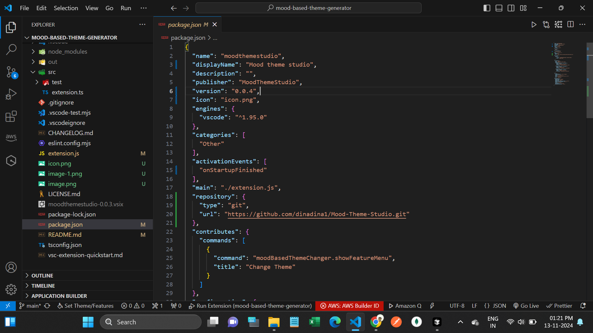

# Mood Theme Studio 🎨

A dynamic VS Code theme extension that automatically adapts to your coding mood based on your typing patterns. Whether you're in deep focus, taking it easy, or somewhere in between, Mood Theme Studio automatically switches themes to match your current state.

## Screenshots 📸

_LI.jpg>)

## Features ✨

- **Auto Mood Detection**: Automatically detects your mood based on typing patterns
  - Focused Mode (>30 chars/30sec): Default Dark Modern theme
  - Neutral Mode (10-30 chars/30sec): Default Dark+ theme
  - Tired Mode (<10 chars/30sec): Default Light Modern theme

- **Manual Theme Control**:
  - Choose from mood-based themes manually
  - Access all installed VS Code themes
  - Create custom color themes

- **Easy Access**:
  - Quick access through status bar icon
  - Simple command palette integration
  - Intuitive theme customization interface

## Installation 📥

1. Open VS Code
2. Go to Extensions (Ctrl+Shift+X)
3. Search for "Mood Theme Studio"
4. Click Install
5. Reload VS Code

Or install directly from the [VS Code Marketplace](https://marketplace.visualstudio.com/items?itemName=MoodThemeStudio.moodthemestudio)

## Usage 🚀

### Auto Mood Detection
- Start typing normally
- The extension will automatically detect your mood and change themes every 30 seconds based on your typing pattern
- The status bar icon shows current status and allows quick access to settings

### Manual Control
1. Click the paintcan icon in the status bar or use Command Palette (Ctrl+Shift+P)
2. Select from options:
   - Mood-Based Themes
   - System Themes
   - Custom Theme Colors
   - Enable/Disable Auto Detection

### Custom Themes
1. Select "Set Custom Theme Colors"
2. Use the color picker to customize:
   - Background
   - Text Color
   - Sidebar
   - Menu Bar
   - Terminal Font

## Requirements 📋

- VS Code version 1.60.0 or higher

## Release Notes 📝

### 1.0.0
- Initial release
- Auto mood detection
- Custom theme support
- System theme integration

### 1.0.1
- Fixed theme switching issues
- Improved mood detection accuracy
- Added status bar indicator

## Contributing 🤝

Contributions are welcome! Please feel free to submit a Pull Request. For major changes, please open an issue first to discuss what you would like to change.

1. Fork the Project
2. Create your Feature Branch (`git checkout -b feature/AmazingFeature`)
3. Commit your Changes (`git commit -m 'Add some AmazingFeature'`)
4. Push to the Branch (`git push origin feature/AmazingFeature`)
5. Open a Pull Request

## License 📄

This project is licensed under the MIT License - see the [LICENSE](LICENSE) file for details.

## Support 💪

If you like this extension, please consider:
- Star the [GitHub repository](https://github.com/dinadina1/Mood-Theme-Studio.git)
- [Rate it on the VS Code Marketplace](https://marketplace.visualstudio.com/items?itemName=MoodThemeStudio.moodthemestudio)
- [Report issues](https://github.com/dinadina1/Mood-Theme-Studio/issues)

## Acknowledgments 🙏

- Thanks to all contributors
- Inspired by the need for dynamic coding environments
- Built with VS Code Extension API

---

**Enjoy coding with a theme that matches your mood!** 🎨✨